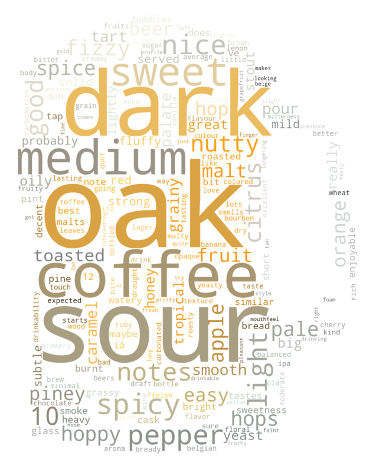

  Come on!
  Embark with us on an aromatic journey through the world of beers, where data not only tells us about the diverse styles but also reveals regional preferences and sentiments woven into the very fabric of beer culture. 
     
  Our analysis draws from two titans of the beer world: <a href="https://www.beeradvocate.com" target="_blank" rel="noopener noreferrer">BeerAdvocate</a> and <a href="https://www.ratebeer.com" target="_blank" rel="noopener noreferrer">RateBeer</a>, each a treasure trove of knowledge and connoisseurship spanning over two decades (till 2017). We've refined our sample to 10% of its original brew, ensuring our analysis is both manageable and rich with the representative essence of beer lovers' worldwide discourse.

   

## The Craft of Categorization

  

    
 In the vast ocean of beer varieties, by taking a taxonomy (shown on the right) that serves as a compass, our dataset comprises a staggering 180 different styles. To navigate this diversity, we've distilled these into 9 quintessential categories: Browns, Pale Ales, Wheats, Stouts, Belgians, Sours, Lagers, Porters, and a category for the avant-garde brews we've dubbed 'Others.' This last category houses the eclectic—fruit beers, barleywines, sake-based concoctions, and smoked varieties—each a testament to the brewer's art.  An example of representitive types for the simplification to these core categories is depicted in the chart next to this text. It's a categorization that allowing us to delve into regional trends with a focused lens.

     
    
  

  

      
    
  

  
### A Map of Tastes

  

    
Our approach involved splitting the data by region and performing a multivariate linear regression across the various categories. The category with the highest coefficient was deemed the regional favorite.

     
    
     
    
 As we can observe, North America and Australia show a preference for stout beers, characterized by their dark hues. Conversely, China, India, and South America exhibit a fondness for Belgian beers, while European tastes lean towards sour beers. Interestingly, Belgians themselves don't favor Belgian beer as much, potentially due to their broader exposure and consequently higher standards for this category. Countries not included in the dataset are marked in grey.

     
  

### Brewing Trends and Local Flavors

  

    
Does local production mirror these regional favorites? We sought to uncover this by first identifying breweries whose reviews are primarily from local beer fans. We choose to say a brewery is local if more than 50% of the reviews where made by users from the same location as the brewery. Then, we computed the average fraction for each category in each region and compared it to the global distribution. The data, Depicted in the maps below, paints a picture of regional production trends compared to global averages. North and Central America, along with China, show a positive deviation, whereas European breweries appear less swayed by regional preferences.

     
    
    
  When comparing local brewery output to the categories that garner the most reviews, we see a predominantly positive z-index across regions. Interestingly, Iceland registers the lowest z-index, aligning with its status as a significant importer due to geographic constraints.  These patterns suggest a possible correlation between the beer varieties produced by local breweries and regional taste preferences. However, the question of causality remains: Does local demand drive brewery production, or do breweries influence regional tastes? The direction of this relationship is an intriguing subject for our next investigation.

    
     
  
  

 
### Time Series Analysis: Unraveling the Trends

  

    
To find answer to those questions, we decided to compare the time series of the following:

    <ul>
        <li style="font-size: 20px;">&bull; The fraction of the different categories produced by breweries (‘beers’ curve on graph bellow).</li>
        <li style="font-size: 20px;">&bull; The fraction of the different categories of beer appearance on the market (‘reviews’ curve on graph bellow).</li>
    </ul>
    
 This analysis aimed to discern if there was a discernible pattern indicating that one trend might influence the other on a global scale. However, we encountered a challenge: our dataset lacked the creation dates for the beers. To overcome this, we used the date of a beer's first review as a proxy for its introduction to the market. We aggregated this data quarterly from 2002 to 2017 to mitigate the impact of unbalanced data outside this period.

    
The resulting graphs reveal distinct trajectories for each beer category, without a clear, overarching trend. It's challenging to ascertain if the production of certain categories drives market trends or vice versa. Intriguingly, traditional beer styles like Browns, Wheats, Belgians, and Lagers saw a dip in popularity post-2010, while Pale Ales and Sours experienced a surge. This shift may correlate with the rise of craft brewing, which has notably diversified the beer landscape over the past decade.

    
  

  
 
## Deciphering the Global Beer Sentiment
 

  

    
In the dataset, we have tons of reviews from all over the world. It's worth to do a sentiment analysis on them. At the beginning, let's have an overview of the reviews from the review cloud! It's generated using TF-IDF method and we extract those top words from all the reviews!  Hope you have an overlook of the reviews. Then, let us start by breaking down the positivity and negativity in the user reviews by the user location. 

    
 In the accompanying visualization of the BeerAdvocate dataset, we note a scarcity of negative sentiments in American reviews, whereas European and Asian feedback often carries a more critical tone. This observed pattern persists across our analyses. RateBeer data, however, exhibits a less pronounced disparity in sentiment. Positivity seems evenly distributed across the globe on BeerAdvocate, but RateBeer suggests American and African users tend to share more positive remarks compared to European users.

  

  

      
    
  

  

    
 This suggests that Americans generally express more favorable reviews, while Europeans approach their commentary with a measured tone. Furthermore, American reviews are less likely to be heavily negative, in contrast to European, South American, or Asian reviews, which display a higher tendency for critical remarks — a behavior colloquially described in French as 'ce sont des râleurs' (they are complainers).

     
    
     
    
 <b>Our exploration took us to two widely recognized breweries: Millers and Weihenstephan, each occupying distinct positions on the rating spectrum. Millers often encounters negativity in reviews, while Weihenstephan enjoys a more favorable outlook.</b>

    
    
<b>Regarding Millers, according to BeerAdvocate data:</b> 
      - There's a pronounced positivity in comments from the U.S., whereas the rest of the world seems less enthused, as indicated by a comparison with the median sentiment. 
      - South American reviews show a tendency toward more negativity than the regional median sentiment. 
      - RateBeer’s data presents a wide variation globally, making any definitive assessment challenging. 
      One might wonder if the positive skew in U.S. reviews is rooted in national pride, taste preferences, or perhaps a narrower range of beer exposure—questions that invite further exploration.
    

     
    
    
<b>As for Weihenstephan, we note:</b> 
      - Globally, the brewery's reviews are tinged with more positivity than the average local sentiment. 
      - It garners more negativity than average in Asia and the Balkans, yet sees less in the remainder of the world. 
      - The U.S. leads with positivity, trailed by Europe and South-East Asia, while South America shows lesser enthusiasm compared to the local average. 
      - South-East Asia exhibits more negativity, but overall, the brewery fares better elsewhere. 
      Certain regions, like Central Europe, consistently exhibit high positivity and low negativity towards Weihenstephan, indicating a general approval. However, some Asian regions present a mixed sentiment. Could these varied responses be attributed to demographic differences within the regions, or is it that Weihenstephan's reputation has yet to be firmly established there? These findings suggest a complex interplay of regional tastes and brewery perceptions.
    

     
  

## Conclusion

  

   
    
Our journey through the global beer landscape reveals an interesting pattern of tastes and trends. From the dark, rich stouts preferred in North America and Australia, to the intricate Belgian styles cherished in Asia and South America, and Europe's penchant for tart sours, each region paints its own flavor profile on the canvas of beer culture.

    
The confluence of local brewery outputs and regional tastes suggests a symbiotic relationship that shapes the craft. While Europeans exhibit a diverse range in their brewing and tasting, it reflects a mature market with a sophisticated palate. Meanwhile, Americans showcase an optimistic view in their reviews, contrasting the more critical and nuanced perspectives from Europe, South America, and Asia.

    
Investigating individual breweries like Millers and Weihenstephan further illuminates these patterns. Millers, with its mixed reception, and Weihenstephan, generally held in high regard, exemplify the varied sentiments that geography can inspire.

    
Lastly, the shifting sands of popularity between classic and emerging beer styles narrate the evolving saga of global taste. Traditional brews give way to the rise of Pale Ales and Sours, championed by the craft beer revolution and a new generation of beer enthusiasts.

    
In essence, the world's beer predilections are as varied as they are vibrant, driven by regional preferences, evolving tastes, and the resonant impact of the craft beer movement.

  

